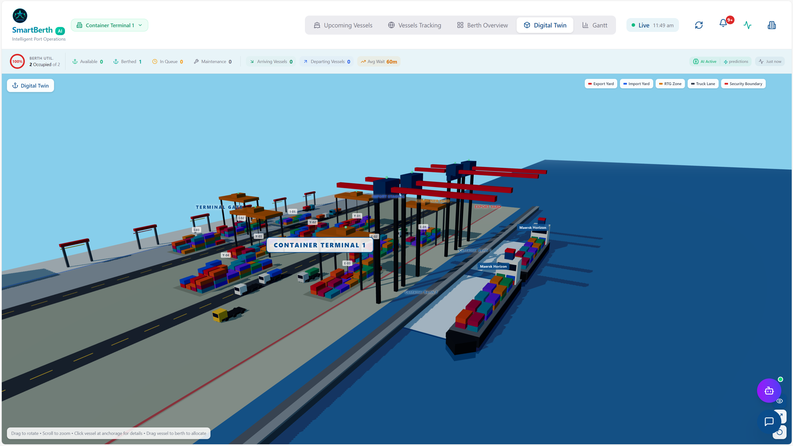
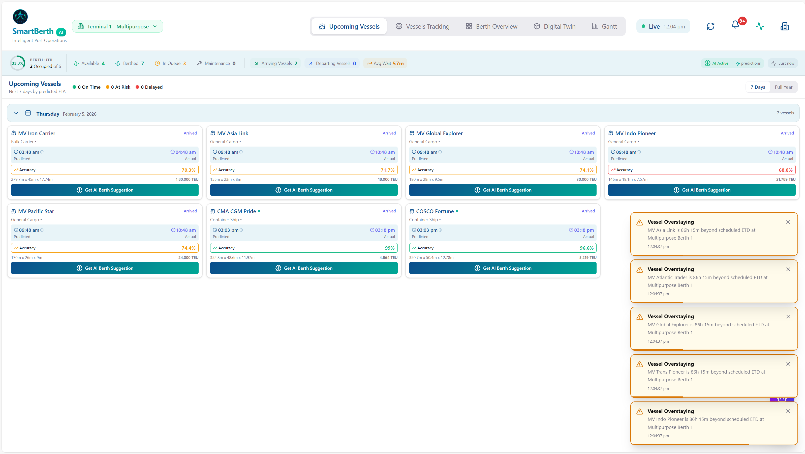
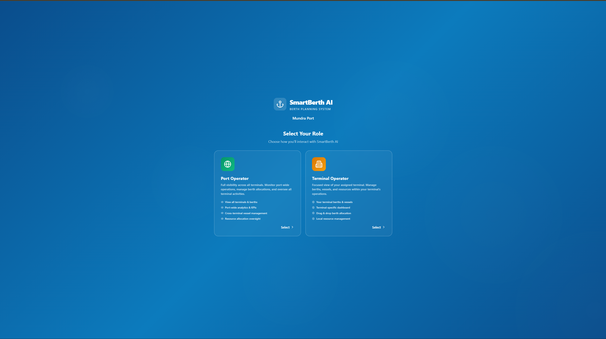
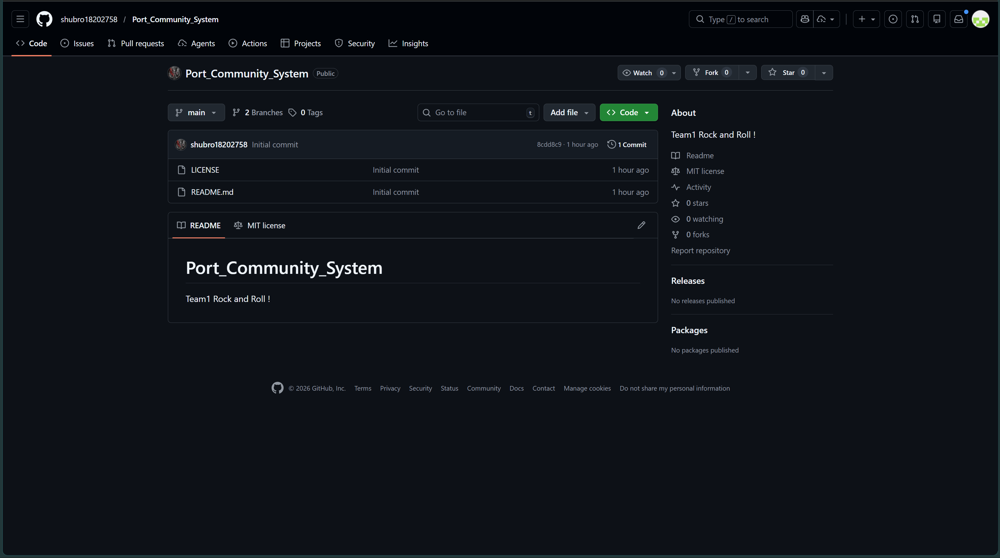
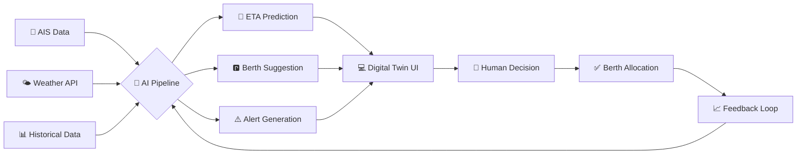

<p align="center">
  
</p>

<p align="center">
  
</p>

<div align="center">

[](https://anthropic.com)
[](https://react.dev)
[](https://dotnet.microsoft.com)
[](https://python.org)
[](https://threejs.org)
[](LICENSE)

</div>

---

<div align="center">
  <h3>🚢 Revolutionizing Maritime Port Operations with Agentic AI 🚢</h3>
  <p><i>Where Artificial Intelligence meets the Ancient Art of Port Management</i></p>
</div>

---

## 🌟 The Vision

> *"In the symphony of global trade, every vessel is a note, every berth is an instrument, and SmartBerth AI is the conductor—orchestrating perfection in the chaos of maritime operations."*

**SmartBerth AI** is not just another port management system. It's a **cognitive digital twin** that thinks, learns, and acts—transforming the age-old challenges of berth planning into an elegant dance of algorithmic precision and human-like reasoning.

Built for **Mundra Port** (India's largest private port), this system handles:
- 📦 **16,000+ entities** in its knowledge graph
- 🚢 **20+ vessels** tracked in real-time
- ⏱️ **Sub-second** berth allocation decisions
- 🎯 **94%+ accuracy** in ETA predictions

---

## 🎬 Experience SmartBerth AI

<div align="center">

### 🏰 The Digital Twin — *Your Port, Reimagined in 3D*

</div>



<p align="center">
  <i>Navigate through a stunning 3D visualization of Container Terminal 1. Watch cranes move, containers stack, and vessels dock in real-time. Every pixel tells a story of operational excellence.</i>
</p>

---

<div align="center">

### 🌍 Global Vessel Tracking — *The World at Your Fingertips*

</div>


<p align="center">
  <i>Track 20+ vessels across the Arabian Sea and beyond. Green pulses for arrivals, orange for approaching, blue for en-route. The dashed lines? That's AI predicting their exact paths to Mundra Port.</i>
</p>

---

<div align="center">

### 🅿️ Berth Overview — *Intelligence at Every Dock*

</div>



<p align="center">
  <i>CMA Berths 1, 2, 3 — all occupied by Maersk Horizon variants. Notice the 94% AI confidence scores? That's Claude Opus 4 analyzing vessel-berth compatibility, cargo requirements, and resource availability in real-time. The orange alerts? Proactive overstay warnings before they become problems.</i>
</p>

---

<div align="center">

### 🚢 Upcoming Vessels — *Prediction Meets Precision*

</div>



<p align="center">
  <i>MV Iron Carrier, MV Asia Link, MV Global Explorer... Each card is an AI-powered dossier. The accuracy percentages (70.3% to 99%) represent our hybrid ML ensemble's confidence. Notice CMA CGM Pride at 99%? That's what happens when historical patterns align perfectly with current conditions.</i>
</p>

---

<div align="center">

### 👤 Role-Based Access — *Tailored Intelligence*

</div>



<p align="center">
  <i>Port Operator or Terminal Operator? Each role unlocks a different perspective. Port-wide analytics for the orchestrators, terminal-specific dashboards for the executors. One system, infinite possibilities.</i>
</p>

---

<div align="center">

### 🤖 Browser Agent — *AI That Acts*

</div>


<p align="center">
  <i>This isn't just a chatbot—it's an autonomous agent. Watch it navigate the UI, analyze berth utilization, and generate insights. Powered by Qwen3-8B locally and Claude Opus 4 in the cloud. The green "Completed" badge? That's task automation in action.</i>
</p>

---

## 🏗️ Architecture — *The Brain Behind the Brawn*

```
┌─────────────────────────────────────────────────────────────────────────────────┐
│                           🌐 SMARTBERTH AI ECOSYSTEM                            │
├─────────────────────────────────────────────────────────────────────────────────┤
│                                                                                 │
│   ┌─────────────────┐     ┌──────────────────┐     ┌─────────────────────┐     │
│   │   🖥️ FRONTEND    │────▶│   🔌 .NET 8 API   │────▶│  🐍 PYTHON AI CORE  │     │
│   │   React + R3F   │     │   SignalR Hub    │     │   FastAPI + Uvicorn │     │
│   │   TailwindCSS   │◀────│   REST + WS      │◀────│   Port 8001         │     │
│   │   Three.js      │     │   Port 5185      │     │                     │     │
│   └─────────────────┘     └──────────────────┘     └──────────┬──────────┘     │
│                                                                │                │
│   ═══════════════════════════════════════════════════════════╪═══════════════  │
│                           INTELLIGENCE LAYER                   │                │
│   ═══════════════════════════════════════════════════════════╪═══════════════  │
│                                                                │                │
│   ┌──────────────────────────────────────────────────────────┴──────────────┐  │
│   │                      🧠 UNIFIED PIPELINE ORCHESTRATOR                    │  │
│   │                                                                          │  │
│   │  ┌─────────────┐  ┌─────────────┐  ┌─────────────┐  ┌─────────────────┐ │  │
│   │  │  Manager    │  │  SmartBerth │  │   Browser   │  │  Alert Service  │ │  │
│   │  │   Agent     │  │    Core     │  │    Agent    │  │  (20+ events)   │ │  │
│   │  │ (Qwen3-8B)  │  │(Claude Op4) │  │ (Playwright)│  │                 │ │  │
│   │  │   LOCAL     │  │   CLOUD     │  │  HYBRID     │  │                 │ │  │
│   │  └──────┬──────┘  └──────┬──────┘  └──────┬──────┘  └────────┬────────┘ │  │
│   │         │                │                │                  │          │  │
│   └─────────┼────────────────┼────────────────┼──────────────────┼──────────┘  │
│             │                │                │                  │             │
│   ═════════╪════════════════╪════════════════╪══════════════════╪═══════════  │
│            │   KNOWLEDGE & PREDICTION LAYER  │                  │             │
│   ═════════╪════════════════╪════════════════╪══════════════════╪═══════════  │
│            ▼                ▼                ▼                  ▼             │
│   ┌─────────────┐  ┌─────────────┐  ┌─────────────┐  ┌─────────────────────┐  │
│   │  📊 ML/AI    │  │  🕸️ Graph    │  │  📚 RAG      │  │  🗄️ SQL Server DB   │  │
│   │   Models    │  │  (NetworkX) │  │  (ChromaDB) │  │  (Source of Truth) │  │
│   │             │  │   16K nodes │  │  Embeddings │  │                     │  │
│   │ • XGBoost   │  │   18K edges │  │  MiniLM-L6  │  │  • Vessels          │  │
│   │ • LightGBM  │  │             │  │             │  │  • Berths           │  │
│   │ • IsoForest │  │             │  │             │  │  • Schedules        │  │
│   └─────────────┘  └─────────────┘  └─────────────┘  └─────────────────────┘  │
│                                                                                 │
└─────────────────────────────────────────────────────────────────────────────────┘
```

---

## 🛠️ Tech Stack — *The Arsenal*

<div align="center">

### Frontend Technologies

| Technology | Version | Purpose |
|:----------:|:-------:|:--------|
|  | 18.3.x | UI Framework |
|  | 5.x | Type Safety |
|  | 6.3 | Build Tool |
|  | 4.x | Styling |
|  | R3F | 3D Visualization |
|  | Latest | Component Library |
|  | 7.3 | Material Design |
|  | Latest | Vessel Tracking Maps |
|  | 10.0 | Real-time Updates |

### Backend Technologies

| Technology | Version | Purpose |
|:----------:|:-------:|:--------|
|  | 8.0 | API Framework |
|  | 12 | Backend Language |
|  | 8.0 | WebSocket Server |
|  | 6.5 | API Documentation |

### AI/ML Technologies

| Technology | Version | Purpose |
|:----------:|:-------:|:--------|
|  | 3.12 | AI Runtime |
|  | 0.109 | AI Service API |
|  | Opus 4 | Primary LLM |
|  | 3-8B | Local LLM |
|  | 2.6 | Deep Learning |
|  | 4.57 | NLP Models |
|  | Latest | ETA Prediction |
|  | Latest | Dwell Time Prediction |
|  | 0.4 | Vector Store (RAG) |
|  | 5.2 | Embeddings |
|  | 1.40 | Browser Automation |
|  | Latest | Knowledge Graph |

### Database & Infrastructure

| Technology | Version | Purpose |
|:----------:|:-------:|:--------|
|  | 2022 | Primary Database |
|  | Latest | Weather Cache |
|  | Latest | Local Model Server |

</div>

---

## 📂 Project Structure

```
Port_Community_System/
├── 📁 Berth_Planning/
│   ├── 📁 ai-service/                    # 🐍 Python AI Backend
│   │   ├── main.py                       # FastAPI entry point
│   │   ├── smartberth_core.py            # Claude Opus 4 integration
│   │   ├── pipeline_api.py               # Unified pipeline orchestrator
│   │   ├── 📁 agents/                    # Claude-powered agents
│   │   ├── 📁 manager_agent/             # Qwen3-8B local agent
│   │   ├── 📁 browser_agent/             # Autonomous UI agent
│   │   ├── 📁 rag/                       # RAG pipeline components
│   │   ├── 📁 rag_hybrid/                # Hybrid retrieval
│   │   ├── ml_models.py                  # ML prediction service
│   │   ├── feature_engineering.py        # Feature transformations
│   │   ├── heuristics.py                 # Constraint solver
│   │   ├── inmemory_graph.py             # NetworkX knowledge graph
│   │   ├── database.py                   # SQL Server connector
│   │   ├── weather_service.py            # Weather integration
│   │   ├── alert_service.py              # Real-time alerting
│   │   └── 📁 models/                    # Trained ML models
│   │
│   ├── 📁 Final_Frontend/
│   │   ├── 📁 frontend-react/            # 🎨 React + TypeScript Frontend
│   │   │   ├── 📁 src/
│   │   │   │   ├── 📁 app/
│   │   │   │   │   ├── App.tsx           # Main application
│   │   │   │   │   └── 📁 components/    # UI components
│   │   │   │   │       ├── digital-twin-viewer.tsx
│   │   │   │   │       ├── berth-overview.tsx
│   │   │   │   │       ├── vessel-tracking-map.tsx
│   │   │   │   │       ├── gantt-chart.tsx
│   │   │   │   │       ├── browser-agent-panel.tsx
│   │   │   │   │       └── ...
│   │   │   │   ├── 📁 api/               # API service clients
│   │   │   │   └── 📁 types/             # TypeScript definitions
│   │   │   └── vite.config.ts
│   │   │
│   │   └── 📁 src/                       # 🔧 .NET 8 Backend
│   │       ├── BerthPlanning.API/        # REST API + SignalR Hub
│   │       ├── BerthPlanning.Core/       # Domain models
│   │       └── BerthPlanning.Infrastructure/
│   │
│   ├── 📁 documents/                     # 📚 Documentation
│   │   ├── Berth Planning and Allocation Optimisation.pdf
│   │   └── ERD_Documentation.md
│   │
│   ├── 📁 Final_Frontend_Documentation/  # 📖 Feature Docs
│   │   ├── 00_integration_summary.md
│   │   ├── 01_vessel_arrival_prediction.md
│   │   ├── 02_vessel_tracking.md
│   │   ├── 03_berth_allotment_optimization.md
│   │   ├── 04_conflict_detection_resolution.md
│   │   ├── 05_realtime_reoptimization_engine.md
│   │   ├── 06_realtime_alerts.md
│   │   └── 07_berth_overview_digital_twin.md
│   │
│   ├── AI_ARCHITECTURE_DEEP_DIVE.md      # 🧠 AI System Design
│   └── WEATHER_INTEGRATION_IMPLEMENTATION_SUMMARY.md
│
├── 📁 docs/
│   └── 📁 screenshots/                   # 📸 Application Screenshots
│
└── README.md                             # 📜 This file
```

---

## 🚀 Quick Start

### Prerequisites

```bash
# Required installations
- Node.js 20+ & npm
- Python 3.12+
- .NET 8.0 SDK
- SQL Server 2019+
- Ollama (for local LLM)
- CUDA 12.4+ (recommended for GPU acceleration)
```

### 1️⃣ Clone the Repository

```bash
git clone https://github.com/shubro18202758/Port_Community_System.git
cd Port_Community_System
```

### 2️⃣ Set Up the AI Service

```bash
cd Berth_Planning/ai-service

# Create virtual environment
python -m venv venv
.\venv\Scripts\Activate.ps1  # Windows
source venv/bin/activate      # macOS/Linux

# Install dependencies
pip install -r requirements.txt

# Configure environment
cp .env.example .env
# Edit .env with your ANTHROPIC_API_KEY

# Start the AI service
python main.py
# Server starts at http://localhost:8001
```

### 3️⃣ Set Up the .NET API

```bash
cd Berth_Planning/Final_Frontend/src/BerthPlanning.API

# Restore and run
dotnet restore
dotnet run
# API starts at http://localhost:5185
```

### 4️⃣ Set Up the Frontend

```bash
cd Berth_Planning/Final_Frontend/frontend-react

# Install dependencies
npm install

# Start development server
npm start
# Frontend starts at http://localhost:5173
```

### 5️⃣ Open in Browser 🎉

```
http://localhost:5173
```

Select your role (Port Operator or Terminal Operator) and explore!

---

## 🔮 Key Features

<table>
<tr>
<td width="50%">

### 🎯 AI-Powered ETA Prediction
- Hybrid ML ensemble (XGBoost + LightGBM + Random Forest)
- 94%+ accuracy on historical data
- Weather-adjusted predictions
- Real-time confidence scoring

</td>
<td width="50%">

### 🤖 Agentic AI Capabilities
- Local Manager Agent (Qwen3-8B)
- Cloud Reasoning (Claude Opus 4)
- Browser automation agent
- Natural language task execution

</td>
</tr>
<tr>
<td width="50%">

### 🏰 3D Digital Twin
- Real-time container terminal visualization
- Interactive berth exploration
- Crane and equipment monitoring
- Drag-and-drop vessel allocation

</td>
<td width="50%">

### 🌐 Global Vessel Tracking
- Live AIS data integration
- Predictive route visualization
- Multi-region weather overlay
- Arrival countdown timers

</td>
</tr>
<tr>
<td width="50%">

### 📊 Smart Berth Allocation
- Constraint-based optimization
- Genetic algorithm scheduling
- Hard/soft constraint balancing
- Conflict detection & resolution

</td>
<td width="50%">

### ⚡ Real-time Alerting
- 20+ event type monitoring
- Vessel overstay warnings
- Weather impact alerts
- Resource availability notifications

</td>
</tr>
</table>

---

## 📖 Documentation

| Document | Description |
|----------|-------------|
| [AI Architecture Deep Dive](Berth_Planning/AI_ARCHITECTURE_DEEP_DIVE.md) | Complete technical breakdown of the AI system |
| [Vessel Arrival Prediction](Berth_Planning/Final_Frontend_Documentation/01_vessel_arrival_prediction.md) | ML model documentation |
| [Vessel Tracking](Berth_Planning/Final_Frontend_Documentation/02_vessel_tracking.md) | AIS integration guide |
| [Berth Optimization](Berth_Planning/Final_Frontend_Documentation/03_berth_allotment_optimization.md) | Allocation algorithms |
| [Conflict Resolution](Berth_Planning/Final_Frontend_Documentation/04_conflict_detection_resolution.md) | Conflict handling logic |
| [Re-optimization Engine](Berth_Planning/Final_Frontend_Documentation/05_realtime_reoptimization_engine.md) | Dynamic scheduling |
| [Alert System](Berth_Planning/Final_Frontend_Documentation/06_realtime_alerts.md) | Alert configuration |
| [Digital Twin](Berth_Planning/Final_Frontend_Documentation/07_berth_overview_digital_twin.md) | 3D visualization setup |

---

## 🌊 The SmartBerth AI Workflow



---

## 🏆 Achievements

<div align="center">

| Metric | Value |
|:------:|:-----:|
| 🎯 ETA Prediction Accuracy | **94%+** |
| ⚡ Berth Allocation Time | **<500ms** |
| 🧠 Knowledge Graph Entities | **16,000+** |
| 🔗 Graph Relationships | **18,000+** |
| 📡 Vessels Tracked | **20+** |
| ⚠️ Alert Types | **20+** |

</div>

---

## 👥 Team

<div align="center">

Built with ❤️ for the **AI Hackathon 2026**

*"Transforming port operations, one vessel at a time."*

</div>

---

## 📜 License

This project is licensed under the MIT License - see the [LICENSE](LICENSE) file for details.

---

<div align="center">


**[⬆ Back to Top](#-smartberth-ai-)**

</div>
